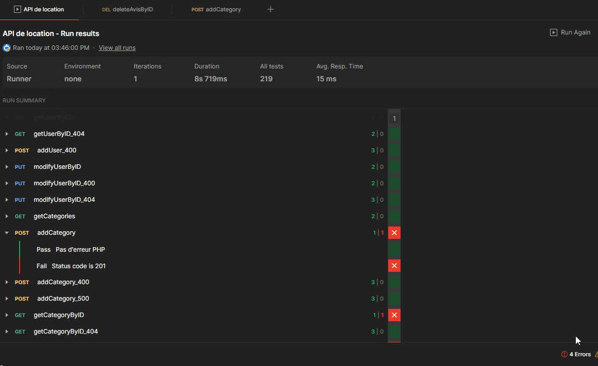

Ce projet est basé sur [API-pour-la-Gestion-de-Location-de-V-hicules](https://github.com/SimonFlorino/API-pour-la-Gestion-de-Location-de-V-hicules)

J'ai pu effectuer les différents tests de cette API avec Postman. 
Vous pouvez importer le JSON dans Postman pour pouvoir tester. 
J'ai documenté mes tests cases dans un fichier CSV  

Execution des tests via la commande automatisé RUN :

